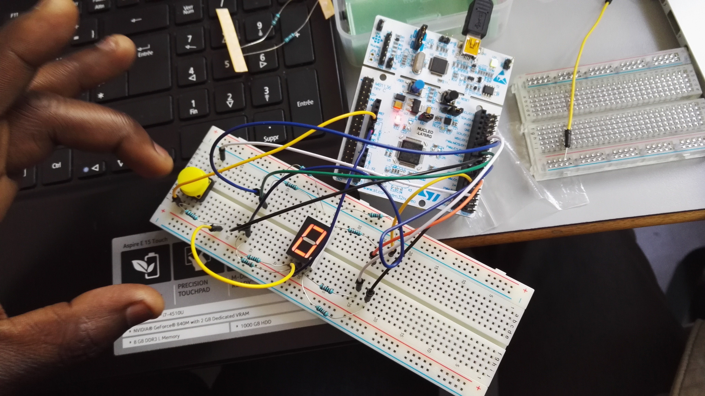
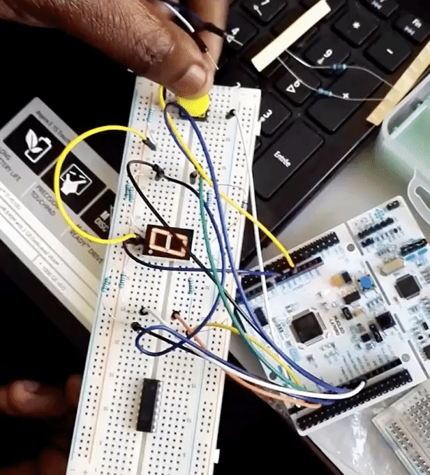
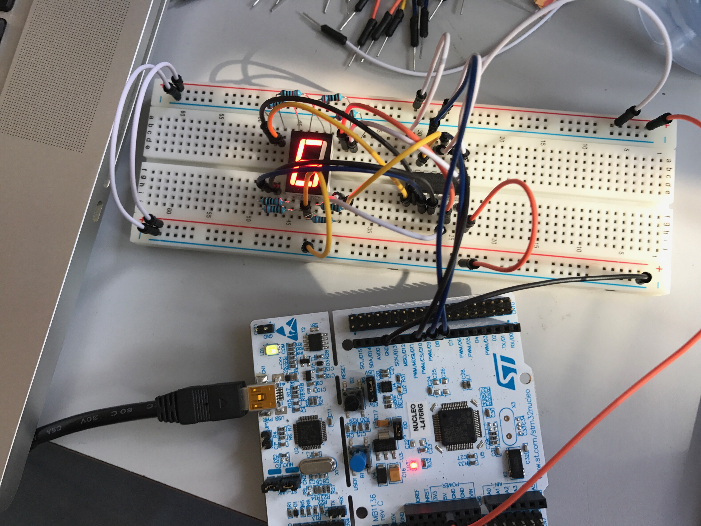
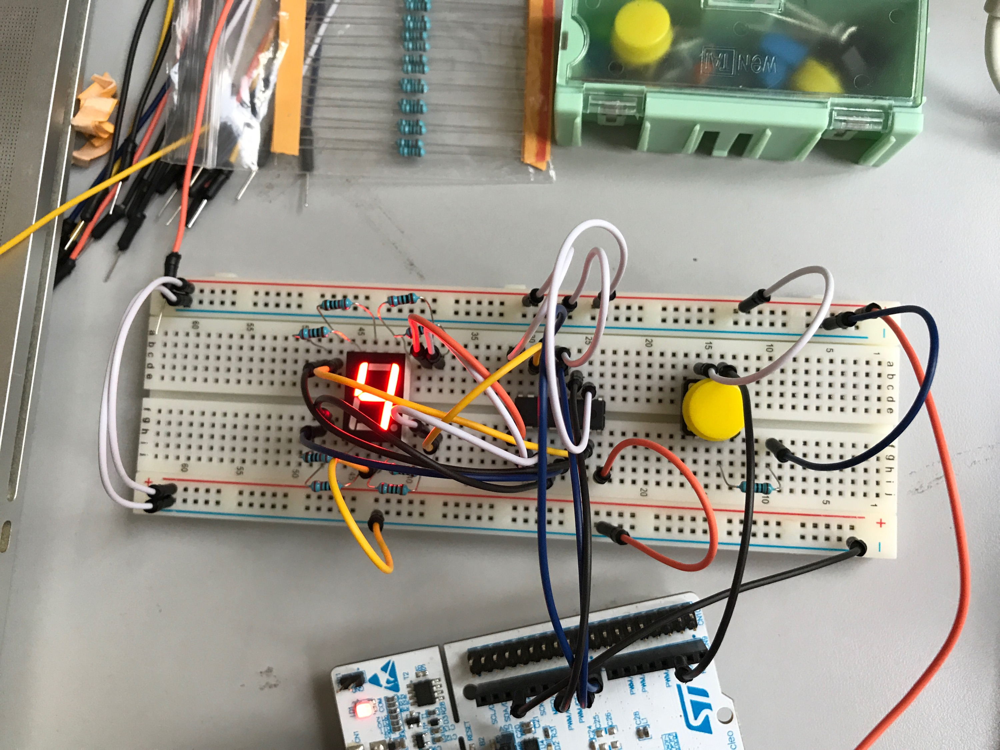
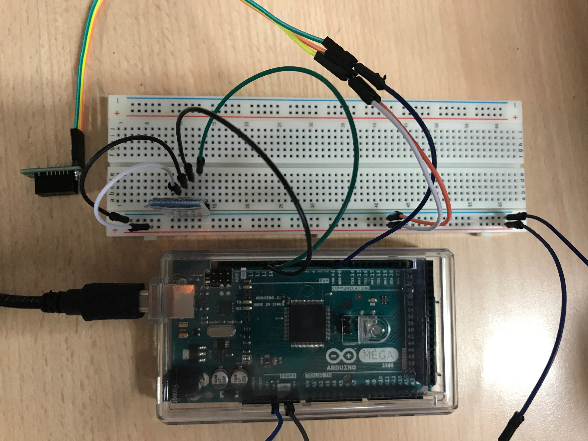

# Objets Communicants

## Sommaire

1. [Feux Tricolores](#feux-tricolores)
2. [Morse](#morse)
3. [Potentiomètre](#potentiomètre)
4. [Temps écoulés](#affichage-du-temps-écoulé-depuis-le-début-du-programme-sur-demande)
5. [Processing](#processing)
6. [7 segments](#7-segments)
7. [PROJET](#projet)

## Installation

* Installation de l'IDE Arduino
* Récupération du lien sur le wiki smt32 contenant le fichier de conf pour la board utilisée
* Référencement du lien dans l'IDE et téléchargement de la configuration de la board
 (https://raw.githubusercontent.com/stm32duino/BoardManagerFiles/master/STM32/package_stm_index.json)

--- 

### Feux Tricolores

#### Montage

#### Ecriture du programme

* Références les pins des leds connectées
* Dans la loop, allumer successivement les feux pour qu'il soient synchronisés
* Attention, pendant qu'une feu est rouge l'autre doit passer à l'orange

#### Résultat

---

### Morse

#### Montage

* Montage Simple avec une led et une résistance branchée sur un port digital

#### Ecriture du programme

* Utilisation du Serial, permet les IO sur l'Arduino
* Lecture d'une chaîne de caractères rentrée par l'utilisateur
* Loop sur les caractères de cette chaîne puis appel, en fonction de la lettre de la bonne séquence (point/tiret)

* Pour afficher une point on allume la led pendant 200ms
* Pour afficher un tiret on allume la led pendant 500ms
* Attention a bien laisser un délai après l'affichage d'un point ou d'un tiret pour bien différencier les lettres

#### Résultat

Voir la vidéo morse.mov dans le dossier Vidéos

---

### Potentiomètre

#### Montage 

* Branchement de deux leds en analogique
* Branchement d'un potentiomètre sur entrée analogique (PWM)

 

#### Ecriture du programme

* Produit en croix afin de transformer la valeur d'entrée (1024 valeurs possibles) sur 255 valeurs
* On remaquer que la LED a une valeur seuil au dessus de laquelle l'intensité ne semble plus augmenter
* L'ajout d'une seconde LED se fait simplement en inversant la valeur de la première (255 - val) 

#### Résultat

 

---

### Affichage du temps écoulé depuis le début du programme sur demande

#### Installation de la lib pyserial

* Installation de la librairie python pyserial via pip
* Repérage du port utilisé par l'Arduino

#### Ecriture du programme 

* Récupération du temps écoulé grâce à la fonction millis()
* Attente de l'entrée du chaine de caractères par l'utilisateur
* Quand la chaîne est recue, affichage avec Serial du temps écoulé
* Connexion en python sur le serial de l'Arduino avec le port récupéré plus tot
* Print de la chaîne imprimée via le programme avec 'print(serial_port.readline())'

#### Résultat

 

---

### Processing

#### Installation

* Installation de l'IDE
* Installation des lib Arduino et controlP5
* Installation du firmware oldStandarFirmata : téléverser depuis l'ide Arduino le fichier Firmata des exemples (spécifique a la board)
* Sur processing, modifier le port COM associé à l'objet Arduino pour qu'il match avec le port utilisé

#### Résultat 

* La LED clignote toute les secondes

---

### 7 segments

#### Montage Simple

#### Programme décompte  

* On allume les segments branché sur les pins correspondante pour afficher chaque chiffre en passant la valeur a HIGH
* On fait un delay entre chaque allumage des pins pour distinguer les chiffres

#### Résultat

#### Montage avec 74HC595

* Sans bouton

* Avec bouton

#### Programme lancement de dés

* On set les pins du registre
* On clear le registre (0 sur toutes les pins)
* On attache a l'interruption (en FALLING) la fonction qui fait le random et allume les segments en fonction du tableau défini
* Dans cette fonction, en fn du nombre random, on set a HIGH les valeurs subséquentes du registre  
* On signale par la pin RCLK que l'écriture dans le registre est finie

#### Résultat

### Projet

#### Installation

* Python
* Mongolab
* Bluetooth (module HC-05)

#### But de l'objet

* Compter le nombre de passage dans une encadrure de porte par exemple

#### Conception

* Test des ultrasons, du capteur de présence
* Finalement, nous avons choisi le capteur IR car c'est celui qui offre la plus grande précison
* Utilisation du HC-05 pour communiquer en bluetooth avec le PC

#### Appairage bluetooth et Ping

* On connecte le module sur le Serial 3
* On passe le HC-05 en mode AT en appuyant sur le bouton prévu pendant le branchement au courant
* On set le baud rate a celui prévu par le HC-05 (38400)
* On envoie une série de commande AT au module pour le configurer

| Commande      | Parametre X   |  Reponse   |  But                        |
| ------------- | ------------- | ---------- | --------------------------- |
| AT+NAME=X     | nom du device | OK         | Définir le nom du device    |
| AT+PSWD=X     | password      | OK         | Définir le mdp d'appairage  |
| AT+ADDR?      | aucun         | Adresse mac| Récupérer l'addresse MAC    |
| AT+RESET      | aucun         | OK         | Reset le HC-05              |

#### Fonctionnement

* On récupère sur l'arduino, toute les 100ms la valeur du capteur IR
* Si la valeur indique une présence on incrémente un compteur
* Toute les 5 secondes, on communique la valeur du compteur en bluetooth au script python, et on reset le compteur
* Le script python lis la valeur sur le serial bluetooth, puis envoie une requete CURL en post sur le mongolab
* Les applications mobiles récupèrent les valeurs sur le mongolab et les affichents sous la forme d'un graphique

#### Montage

#### Application mobile

#### Difficulté rencontrés

* Pour faire le setup du HC-05, il faut passer par le Serial3 par ex
* Pour envoyer des données en bluetooth, utiliser le SoftwareSerial avec un println
* Pour lire les données côté script python, récupérer le port en faisant > ls -lart /dev puis > serial.Serial(port)
