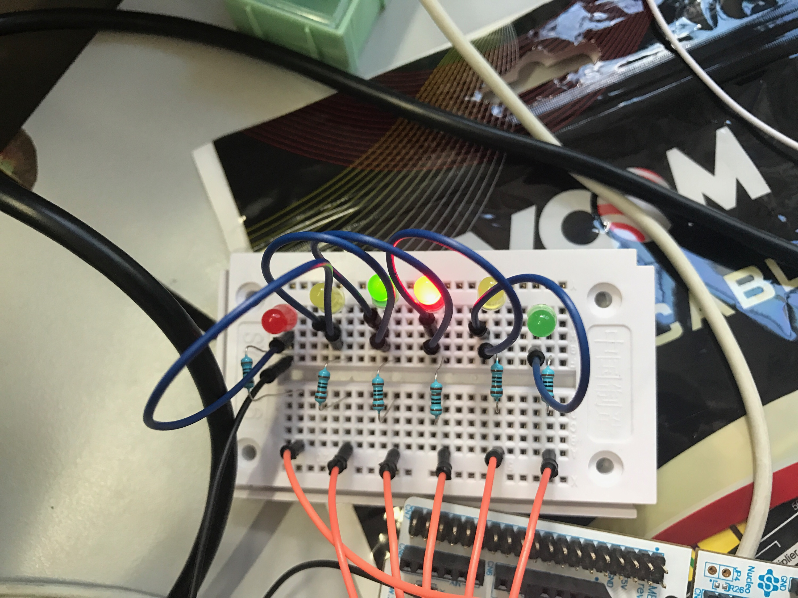
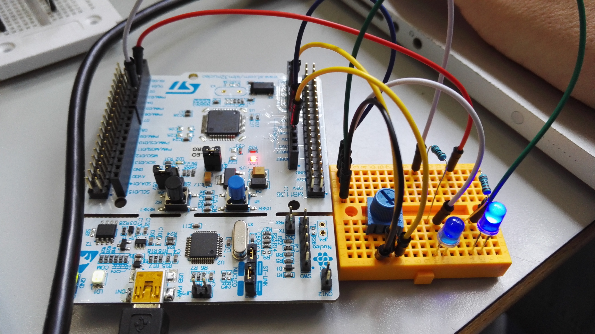
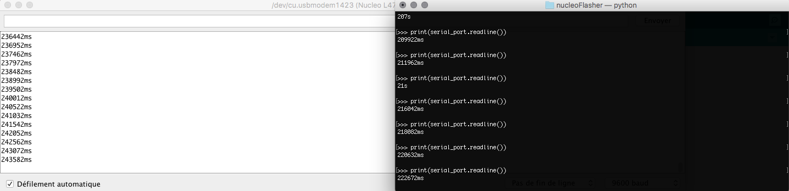

# Objets Communicants

### Installation

* Installation de l'IDE Arduino
* Récupération du lien sur le wiki smt32 contenant le fichier de conf pour la board utilisée
* Référencement du lien dans l'IDE et téléchargement de la configuration de la board
 (https://raw.githubusercontent.com/stm32duino/BoardManagerFiles/master/STM32/package_stm_index.json)

## Feux Tricolores

### Montage

### Ecriture du programme

* Références les pins des leds connectées
* Dans la loop, allumer successivement les feux pour qu'il soient synchronisés
* Attention, pendant qu'une feu est rouge l'autre doit passer à l'orange

### Résultat

## Morse

### Montage

* Montage Simple avec une led et une résistance branchée sur un port digital

### Ecriture du programme

* Utilisation du Serial, permet les IO sur l'Arduino
* Lecture d'une chaîne de caractères rentrée par l'utilisateur
* Loop sur les caractères de cette chaîne puis appel, en fonction de la lettre de la bonne séquence (point/tiret)

* Pour afficher une point on allume la led pendant 200ms
* Pour afficher un tiret on allume la led pendant 500ms
* Attention a bien laisser un délai après l'affichage d'un point ou d'un tiret pour bien différencier les lettres

### Résultat

Voir la vidéo morse.mov dans le dossier Vidéos

## Potentiomètre

### Montage 

* Branchement de deux leds en analogique
* Branchement d'un potentiomètre sur entrée analogique (PWM)

 

### Ecriture du programme

* Produit en croix afin de transformer la valeur d'entrée (1024 valeurs possibles) sur 255 valeurs
* On remaquer que la LED a une valeur seuil au dessus de laquelle l'intensité ne semble plus augmenter
* L'ajout d'une seconde LED se fait simplement en inversant la valeur de la première (255 - val) 

### Résultat

 

## Affichage du temps écoulé depuis le début du programme sur demande

### Installation de la lib pyserial

* Installation de la librairie python pyserial via pip
* Repérage du port utilisé par l'Arduino

## Ecriture du programme 

* Récupération du temps écoulé grâce à la fonction millis()
* Attente de l'entrée du chaine de caractères par l'utilisateur
* Quand la chaîne est recue, affichage avec Serial du temps écoulé
* Connexion en python sur le serial de l'Arduino avec le port récupéré plus tot
* Print de la chaîne imprimée via le programme avec 'print(serial_port.readline())'

## Résultat

 
